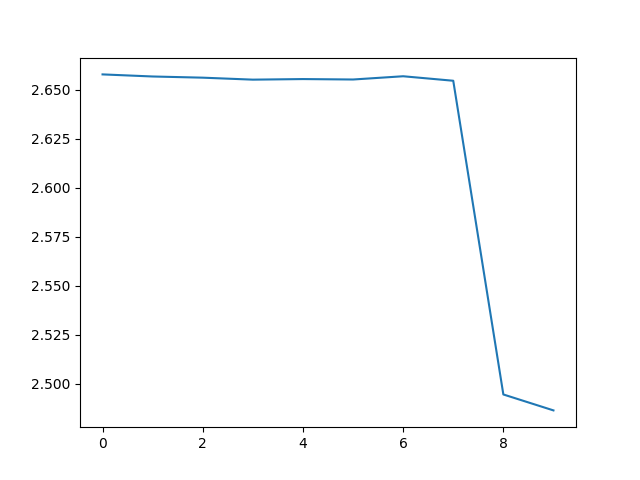
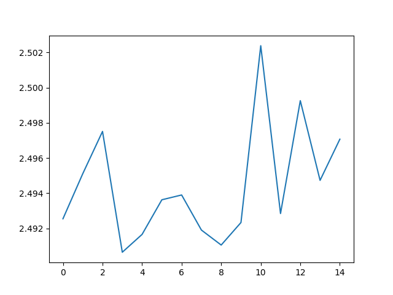
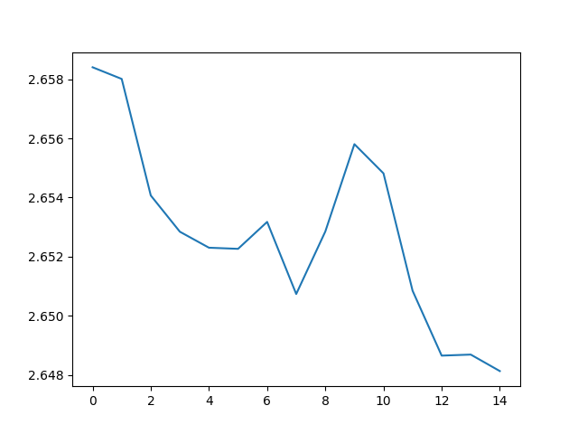
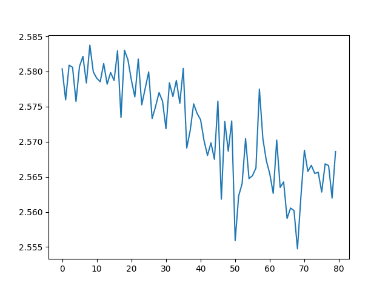

# Overview

In this repo i tried using RNN for image classification on cloth dataset.
The idea is to extract features/descriptors from the images using openCv ORB detector (since it's fast) and feed descriptor vectors to the RNN.

Since the main purpose of this project it to be familiar with how sequential networks work (RNN/LSTM) i wasn't expecting good results rather to see the model work.

Implementation for LSTM didn't work, as i was getting an error of modifying the parameters in place.

## dataset
[Keggel cloth dataset](https://www.kaggle.com/agrigorev/clothing-dataset-full)

## Data analysis
* is the data set balanced? meaning all classes appear more or less the same number of time?
  * Should use weights vector with the loss function to cover up the unbalance?
  * Or should the augmentation make the balance
* size of the images

## data loader
* Creating a dataloader for the pytorch models to load the samples from
* Since this is an image dataset, need to do image aumentation
  * warp
  * change contrast
  * blurring
  * cropping
* partition into training, validation and testing
  * does the training and validation sets include samples covering all the possible lables?
  
## features
creating feature vector per image using descriptor vector - here im using ORB because it's fast and there are a lot of images.

## RNN
This model didn't do very well, bellow is a track of a training iteration of 15 epoches:
15 out of total 539 predictions were right. (2.7%)

Here are 3 graphs of the loss during the training:

It's worth mentioning that the dataset is not balanced.
For the next try, will decrease the learning-rate a bit and balance the dataset
Increased the training to 80 epoches (took ~6hrs!) and did improve slightly: 37 ight guesses out of 553 (6.6%)

(see assets folder for the graphs images)
